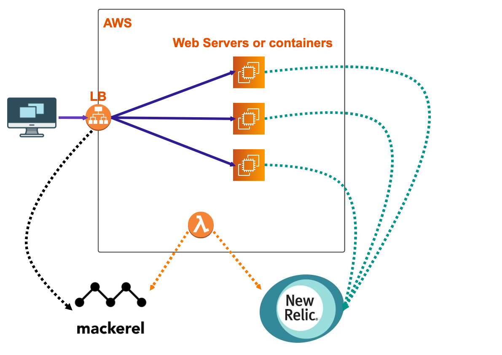

# sli-handler  
Provide an easy way to catch your web system's SLI based on AWS Lamabda functions.  
  

Certainly, functions are ready to be deployed by using [terraform](https://www.terraform.io/).  

# Prerequisite  
- AWS account  
- Mackerel account
- Newrelic account
- And some patience...

# Usage
```
# First of all, you need setup your mackerel account & newrelic account into config file
# In this case, ↓
# lambda_variables.tf

# setup your aws account
$ export AWS_ACCESS_KEY=<your aws access key>
$ export AWS_SECRET_ACCESS_KEY=<your aws secret access key>

# setup lambda functions
$ sh build_lambda.sh

# deploy to aws account
$ terraform plan
$ terraform apply
```

