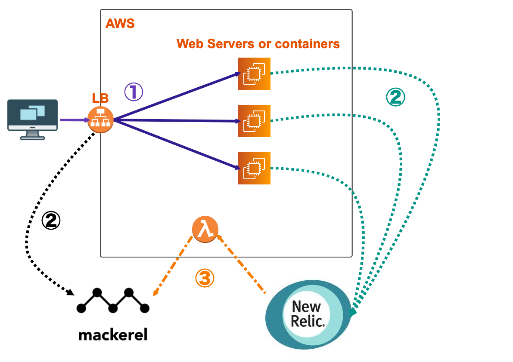
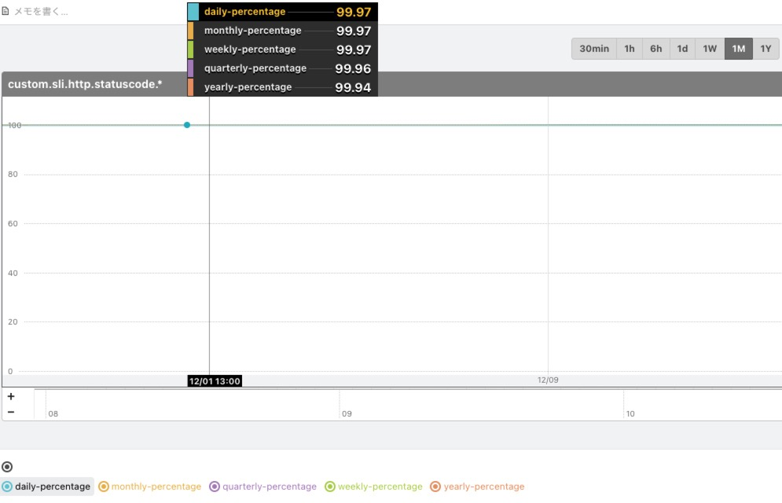
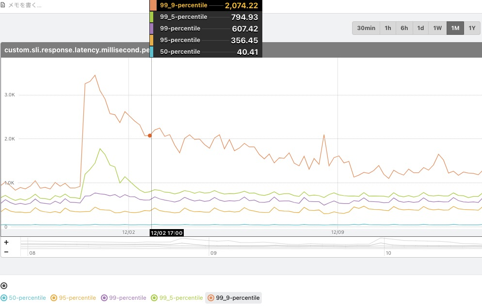

# sli-handler  
Provide an easy way to catch your web system's SLI(Service Level Indicators) based on AWS Lamabda functions.  
  


- Data collection  
  - Mackerel can catching data from Loadbalancer
  - Newrelic can catching data from web servers(or containers)
- SLI(Service Level Indicators) visualization
  - Count SLI by Lambda functions
  - Output SLI data to Mackerel service metrics

## Metrics Sample
You may get several metrics like them below.  



# Deployment
You can copy & paste lambda functions file to AWS account directly.  
Or, certainly, functions are ready to be deployed by using [terraform](https://www.terraform.io/).  
__See [Usage](https://github.com/kuritan/sli-handler#usage) below for more details.__

# Prerequisite  
- AWS account  
- Mackerel account
- Newrelic account
- And some patience...

# Usage
```
# First of all, you need setup your mackerel account & newrelic account into config file
# In this case, ↓
# lambda_variables.tf

# setup your aws account
$ export AWS_ACCESS_KEY=<your aws access key>
$ export AWS_SECRET_ACCESS_KEY=<your aws secret access key>

# setup lambda functions
$ sh build_lambda.sh

# deploy to aws account
$ terraform plan
$ terraform apply
```

